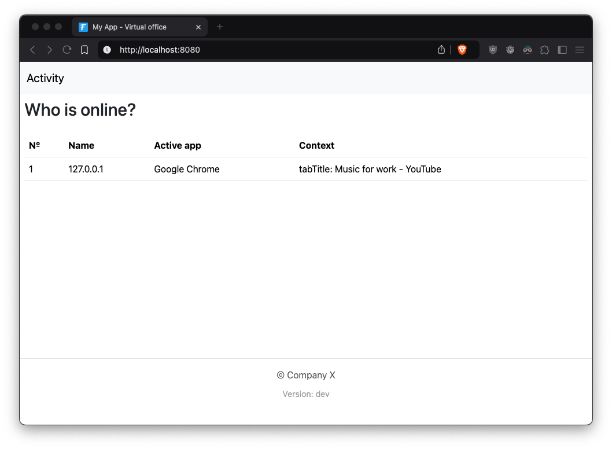

# Activity

This is POC of activity tracking system.

## Purpose

1. Context for virtual office. Bob is watching YouTube and Alice is coding in editor.



2. Time tracking, how much apps was used during some time period. Bob was wathing youtube in Chrome for 6 hours in row, but Alice was using VSCode for 10 hours.


## Architecture

How we display which app is active on each host:
- Agent is a desktop app, in my case it's Mac OS app.
- Each agent is connected to server
- Server accepts agents connections and updates list, on disconnect it removes agent from list. Also server keeps all browser connections the same way.
- Updated state from agents goes to hub and sends to all browsers using broadcast message
- Browser updates data from websocket using htmx and websocket extension

How we count how many hours app was in use?
- We share message struct in [protocol](./internal/model/protocol.go) file and unpack it on server
- After unpacking we resend it to tsdb
- tsdb can aggregate data by timestamps

```
                                        +-----------------------------+             +--------------------+
                                        |                             |             |   browser 1        |
                                        |accept             broadcast |     ws      |                    |
                                        |    +----------+             <-------------+                    |
                          +------------->    |  hub     |             |             |                    |
                          |             |    |          |             <-----+       |                    |
                          |   +-------->|    |          |             |     |       |                    |
                          |   |         |    |          |             |     |       |                    |
+-------------+           |   |         |    +--^---+---+             |     |       |                    |
|             |           |   |         |       |   |                 |     |       |                    |
|             |           |   |         |    +--+---v---+             |     |       +--------------------+
| agent host 1|           |   |         |    | storage  |             |     |
|             |     ws    |   |         |    |          |             |     |
|             +-----------+   |         |    |          |             |     |
|             |               |         |    |          |             |     |
|             |               |         |    +----------+             |     |
|             |               |         +---------+-------------------+     |
+-------------+               |                   |                         |       +--------------------+
                              |                   |                         |       |   browser 2        |
                              |                   |                         |       |                    |
+-------------+               |                   |                         | ws    |                    |
|             |               |                   |                         +-------+                    |
|             |               |                   |                                 |                    |
| agent host 2|               |                   |                                 |                    |
|             |       ws      |                   |                                 |                    |
|             +---------------+               +---v----+                            |                    |
|             |                               |        |                            |                    |
|             |                               | tsdb   |                            +--------------------+
|             |                               |        |
+-------------+                               |        |
                                              +--------+
```

### Scaling

To scale server for many messages we can:
- Use multiple instances os server
    - Split load by agents: can create balancing algorithm based on number of connections.
    - UI part should be removed from server. We can add new service - Control panel and create internal RPC between server and Control panel. Control panel can have API for frontend, and UI part can be separated into frontend app.
- Use binary protocol between agent and server
- Use batch send and compression
- Use logic similar to WAL in databases. Store raw data in some chunks for recovery, but rest data will be pre-aggregated in chunks on host and sended to server.

Improve agents:
- Heavily profile app and optimize cpu and memory footprint
- Add more recovery scenarios

## What was uncovered?

### Agent

- Apps introspection
    - Need to integrate with popular apps, each app is different and requires specific scripts
        - Which track is playing in Spotify, what tab is opened in browser?
            - Apple script, dbus-send, smth for Windows?
        - Which app is runned in terminal, what if I use vim or tmux?
            - can be captured by PS util in UNUX, but IDK in Windows
    - Need black list of apps which cannot to be captured by agent
    - Need list of apps which cannot be introspected
- Better MacOS intergration (maybe rewrite in Swift?)
    - Menubar
    - Settings
    - Updates
- More platforms
    - Windows
    - Linux
- Binary self-protection
- Handling websocket reconnections
- Send parts of data from log after being offline

Different approach: use browser extension (maybe with Rust and WASM) and run subprocess to fetch the same data and send to server.

### Server

- Auth
- Secure connection (wss)
- Blocking and removing agents
- Performance testing

### Both

- Testing
- Packaging
- Deployment
- Metrics

## Local run

1. Install XCode (required for agent)

2. Copy config template:

```sh
cp .env.example .env
```

Fill config variables values in `.env`

3. Run apps:

First run server

```sh
make run-server
# OR
make run-agent
```

Then run agent

```sh
make run-agent
```

Now open `http://localhost:8080/` in browser.
