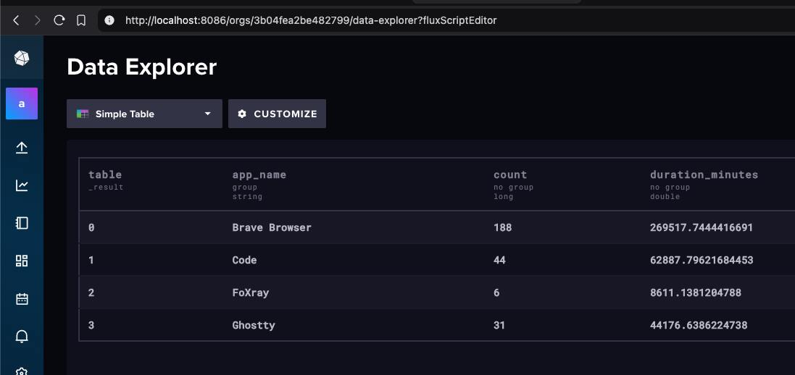

# Activity

This is a proof of concept (POC) for an activity tracking system.

## Purpose

1. Context for a virtual office. Bob is watching YouTube while Alice is coding in an editor.


2. Time tracking: how much time apps were used during a certain period. Bob watched YouTube in Chrome for 6 hours straight, while Alice used VSCode for 10 hours.



## Architecture

### How we display which app is active on each host:
- The agent is a desktop app, in this case, a macOS app.
- Each agent is connected to the server.
- The server accepts agent connections and updates the list. On disconnect, it removes the agent from the list. The server also keeps all browser connections in the same way.
- Updated state from agents goes to the hub and is sent to all browsers using broadcast messages.
- The browser updates data from the websocket using htmx and websocket extension.

### How we count how many hours an app was in use:
- We share the message struct in the [protocol](./internal/model/protocol.go) file and unpack it on the server.
- After unpacking, we resend it to the time series database (tsdb).
- The tsdb can aggregate data by timestamps.

```
                                        +-----------------------------+             +--------------------+
                                        |                             |             |   browser 1        |
                                        |accept             broadcast |     ws      |                    |
                                        |    +----------+             <-------------+                    |
                          +------------->    |  hub     |             |             |                    |
                          |             |    |          |             <-----+       |                    |
                          |   +-------->|    |          |             |     |       |                    |
                          |   |         |    |          |             |     |       |                    |
+-------------+           |   |         |    +--^---+---+             |     |       |                    |
|             |           |   |         |       |   |                 |     |       |                    |
|             |           |   |         |    +--+---v---+             |     |       +--------------------+
| agent host 1|           |   |         |    | storage  |             |     |
|             |     ws    |   |         |    |          |             |     |
|             +-----------+   |         |    |          |             |     |
|             |               |         |    |          |             |     |
|             |               |         |    +----------+             |     |
|             |               |         +---------+-------------------+     |
+-------------+               |                   |                         |       +--------------------+
                              |                   |                         |       |   browser 2        |
                              |                   |                         |       |                    |
+-------------+               |                   |                         | ws    |                    |
|             |               |                   |                         +-------+                    |
|             |               |                   |                                 |                    |
| agent host 2|               |                   |                                 |                    |
|             |       ws      |                   |                                 |                    |
|             +---------------+               +---v----+                            |                    |
|             |                               |        |                            |                    |
|             |                               | tsdb   |                            +--------------------+
|             |                               |        |
+-------------+                               |        |
                                              +--------+
```

### Scaling

To scale the server for many messages, we can:
- Use multiple instances of the server:
    - Split the load by agents: create a balancing algorithm based on the number of connections.
    - The UI part should be removed from the server. We can add a new service - Control Panel - and create internal RPC between the server and Control Panel. The Control Panel can have an API for the frontend, and the UI part can be separated into a frontend app.
- Use a binary protocol between the agent and the server.
- Use batch send and compression.
- Use logic similar to WAL in databases. Store raw data in chunks for recovery, but the rest of the data will be pre-aggregated in chunks on the host and sent to the server.

### Improve agents:
- Heavily profile the app and optimize CPU and memory footprint.
- Add more recovery scenarios.

## What was uncovered?

### Agent

- Apps introspection:
    - Need to integrate with popular apps, each app is different and requires specific scripts:
        - Which track is playing in Spotify? What tab is opened in the browser?
            - AppleScript, dbus-send, something for Windows?
        - Which app is running in the terminal? What if I use vim or tmux?
            - Can be captured by PS util in UNIX, but I don't know about Windows.
    - Need a blacklist of apps that cannot be captured by the agent.
    - Need a list of apps that cannot be introspected.
- Better macOS integration (maybe rewrite in Swift?):
    - Menubar.
    - Settings.
    - Updates.
- More platforms:
    - Windows.
    - Linux.
- Binary self-protection.
- Handling websocket reconnections.
- Send parts of data from the log after being offline.

Different approach: use a browser extension (maybe with Rust and WASM) and run a subprocess to fetch the same data and send it to the server.

### Server

- Authentication.
- Secure connection (wss).
- Blocking and removing agents.
- Performance testing.

### Both

- Testing.
- Packaging.
- Deployment.
- Metrics.

## Local run

1. Install XCode (required for the agent).

2. Copy the config template:

```sh
cp .env.example .env
```

Fill in the config variables values in `.env`.

3. Run the apps:

First, run the server:

```sh
make run-server
```

Then, run the agent:

```sh
make run-agent
```

Now open `http://localhost:8080/` in your browser.
